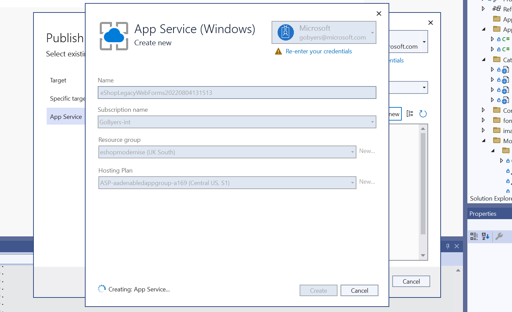
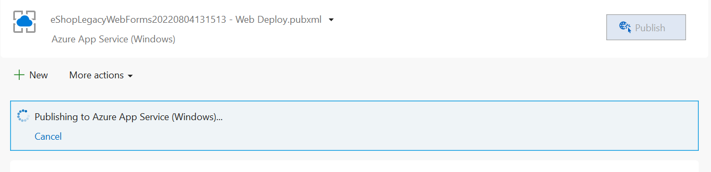
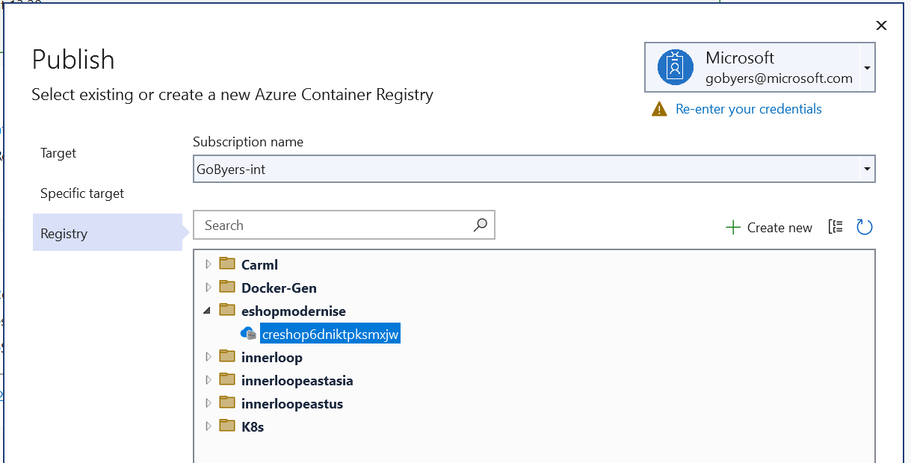
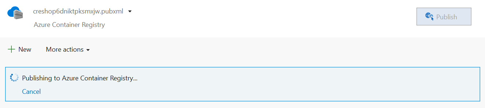
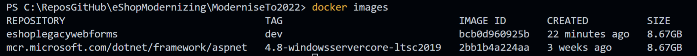

# Modernising to Windows Server 2022

## Step 1 - Getting the app running

Before modernising starts, it's best to see the app running and working properly.

### Compilation Error

If you find you receive a compilation error for roslyn;
> 'Could not find a part of the path '\eShopModernizing\eShopLegacyWebFormsSolution\src\eShopLegacyWebForms\bin\roslyn\csc.exe''

Then this can be resolved by running this command in the Package Manager Console;

```powershell
Update-Package Microsoft.CodeDom.Providers.DotNetCompilerPlatform -r
```

### Running the app


## Step 2 - Publishing to an Azure VM

It can be useful to see the app working on a traditional Windows VM as part of the modernisation journey.

This provides a more realistic environment to run the app from, than your local development workstation. It later stages it can also enable domain account synchronisation to Azure AD.

```bash
az group create -n eshopmodernise -l uksouth
```

## Step 3 - Connecting to SQL

First we need to create the SQL database infrastructure in Azure.

```bash
az deployment group create -g eshopmodernise -f sqlServer.bicep
```

Next, we need to configure the web app not to use Mock data, and instead to use a SQL Server Database. For this, open the web.config file and change UseMockData to false.

```xml
  <appSettings>
    <add key="UseMockData" value="false" />
    <add key="UseCustomizationData" value="false" />
  </appSettings>
```

Using the Azure Portal, you can view the connection strings for the newly created SQL Database. Replace the connection string in the web.config file, noting the database name has to be `Microsoft.eShopOnContainers.Services.CatalogDb`.

old

```xml
  <connectionStrings>
    <add name="CatalogDBContext" connectionString="Data Source=(localdb)\MSSQLLocalDB; Initial Catalog=Microsoft.eShopOnContainers.Services.CatalogDb; Integrated Security=True; MultipleActiveResultSets=True;" providerName="System.Data.SqlClient" />
  </connectionStrings>
```

new

```xml
  <connectionStrings>
    <add name="CatalogDBContext" connectionString="VALUE FROM AZURE PORTAL, WITH YOUR DEFINED PASSWORD INSERTED" />
  </connectionStrings>
```

## Step 4 - Deploying to App Service





## Step 5 - Modernising to Windows Containers

Visual Studio makes it easy to add a DockerFile to the application by selecting the project, Add, Docker Support.
Here's what gets generated.

```dockerfile
FROM mcr.microsoft.com/dotnet/framework/aspnet:4.8-windowsservercore-ltsc2019
ARG source
WORKDIR /inetpub/wwwroot
COPY ${source:-obj/Docker/publish} .
```

Now we can run the application locally in a container from Visual Studio.

### Pushing the container to ACR

Azure has a container registry for container image storage.

Lets create the registry now.

```bash
az deployment group create -g eshopmodernise -f .\acr.bicep
```

Now from Visual Studio we can push the image. In a more structured environment, this would be via the CI/CD system.





This can take some time to upload, and if we run the `docker images` command - then we can see why.



## Step 6 - Deploying to Azure App Service (Containers)

Now that we have our Container Image in Azure, there are several compute options for hosting it. We'll start by looking at App Service (Containers).


## Step 7 - Deploying to Azure Kubernetes Service

## Step 7 - Using Azure AD for SQL Authentication
