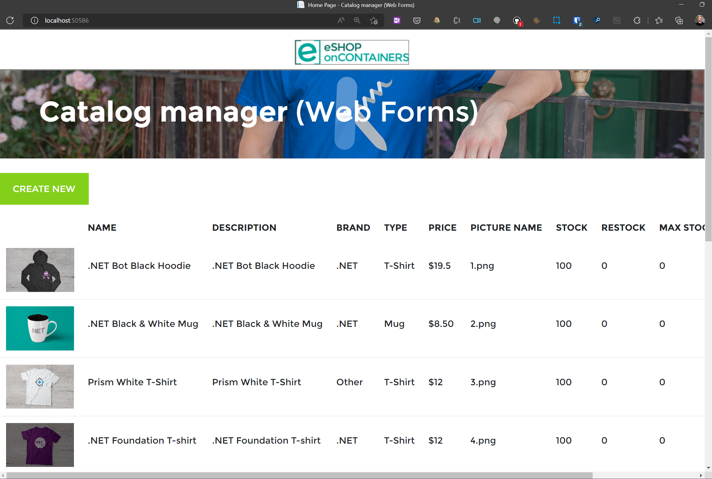

# Modernising to Windows Server 2022

## Step 1 - Getting the app running

Before modernising starts, it's best to see the app running and working properly.

### Compilation Error

If you find you receive a compilation error then it can be resolved with 
'Could not find file ... bin\roslyn\csc.exe' [duplicate]

```powershell
Update-Package Microsoft.CodeDom.Providers.DotNetCompilerPlatform -r
```

### Running the app



## Step 2 - Publishing to an Azure VM

It can be useful to see the app working on a traditional Windows VM as part of the modernisation journey.

This provides a more realistic environment to run the app from, than your local development workstation. It later stages it can also enable domain account synchronisation to Azure AD.

```bash
az group create -n eshopmodernise -l uksouth
```

## Step 3 - Connecting to SQL

First we need to create the SQL database infrastructure in Azure.

```bash
az deployment group create -g eshopmodernise -f sqlServer.bicep
```

Next, we need to configure the web app not to use Mock data, and instead to use a SQL Server Database. For this, open the web.config file and change UseMockData to false.

```xml
  <appSettings>
    <add key="UseMockData" value="false" />
    <add key="UseCustomizationData" value="false" />
  </appSettings>
```

Using the Azure Portal, you can view the connection strings for the newly created SQL Database. Replace the connection string in the web.config file.

old

```xml
  <connectionStrings>
    <add name="CatalogDBContext" connectionString="Data Source=(localdb)\MSSQLLocalDB; Initial Catalog=Microsoft.eShopOnContainers.Services.CatalogDb; Integrated Security=True; MultipleActiveResultSets=True;" providerName="System.Data.SqlClient" />
  </connectionStrings>
```

new

```xml
  <connectionStrings>
    <add name="CatalogDBContext" connectionString="VALUE FROM AZURE PORTAL, WITH YOUR DEFINED PASSWORD INSERTED" />
  </connectionStrings>
```

### Azure AD credentials

## Step 4 - Modernising to Windows Containers

## Step 5 - Deploying to Azure App Service

## Step 6 - Deploying to Azure Kubernetes Service
