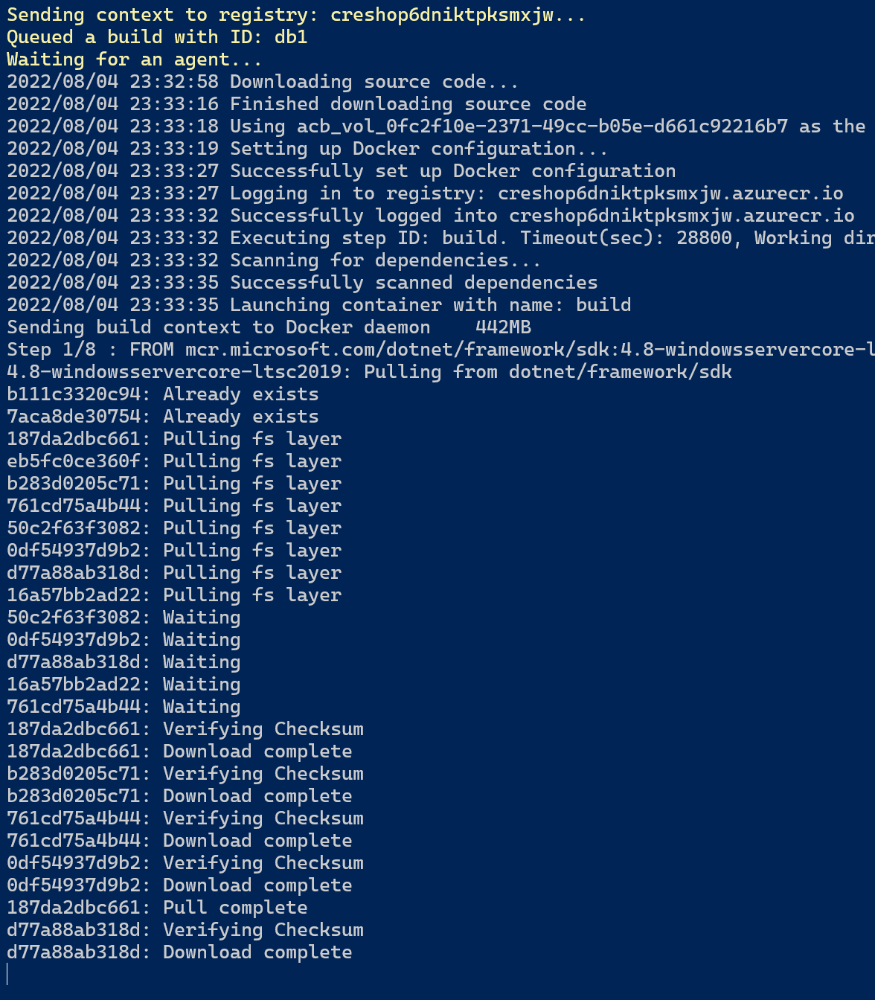

# Modernising to Windows Server 2022

This guide provides a step by step, developer centric view of migrating legacy ASP.NET applications to Azure.
For a tool based approach using  Azure Migrate: App Containerization tool, please see [https://docs.microsoft.com/azure/migrate/tutorial-app-containerization-aspnet-kubernetes](https://docs.microsoft.com/azure/migrate/tutorial-app-containerization-aspnet-kubernetes) or [https://docs.microsoft.com/azure/migrate/tutorial-app-containerization-aspnet-app-service](https://docs.microsoft.com/azure/migrate/tutorial-app-containerization-aspnet-app-service), noting that current tool doesn't support Apps that use Windows Authentication or have non IIS dependencies.

## Step 1 - Getting the app running

Before modernising starts, it's best to see the app running and working properly.

Clone or download this GitHub repository, and open the `eShopLegacyWebFormsSolution/eShopLegacyWebForms.sln` file in Visual Studio.

### Compilation Error

If you find you receive a compilation error for roslyn;
> 'Could not find a part of the path '\eShopModernizing\eShopLegacyWebFormsSolution\src\eShopLegacyWebForms\bin\roslyn\csc.exe''

Then this can be resolved by running this command in the Package Manager Console;

```powershell
Update-Package Microsoft.CodeDom.Providers.DotNetCompilerPlatform -r
```

### Running the app

As simple as pressing start, we now have the application working with an in-memory database.


## Step 2 - Publishing to an Azure VM

It can be useful to see the app working on a traditional Windows VM as part of the modernisation journey.

This provides a more realistic environment to run the app from, than your local development workstation. It later stages it can also enable domain account synchronisation to Azure AD.

Create a resource group for all the Azure resources we'll need.

```bash
az group create -n eshopmodernise -l uksouth
```

Create a Web Server VM : [https://docs.microsoft.com/azure/virtual-machines/windows/quick-create-cli#create-virtual-machine](https://docs.microsoft.com/azure/virtual-machines/windows/quick-create-cli#create-virtual-machine)

## Step 3 - Connecting to a SQL database

The application is working from an in-memory database, and the next step is to configure it to use an Azure SQL Database.

First we need to create the actual SQL database infrastructure in Azure.

```bash
az deployment group create -g eshopmodernise -f sqlServer.bicep
```

Next, we need to configure the web app not to use Mock data, and instead to use a SQL Server Database. For this, open the web.config file and change UseMockData to false.

```xml
  <appSettings>
    <add key="UseMockData" value="false" />
    <add key="UseCustomizationData" value="false" />
  </appSettings>
```

Using the Azure Portal, you can view the connection strings for the newly created SQL Database. Replace the connection string in the web.config file, noting the database name has to be `Microsoft.eShopOnContainers.Services.CatalogDb`.

old

```xml
  <connectionStrings>
    <add name="CatalogDBContext" connectionString="Data Source=(localdb)\MSSQLLocalDB; Initial Catalog=Microsoft.eShopOnContainers.Services.CatalogDb; Integrated Security=True; MultipleActiveResultSets=True;" providerName="System.Data.SqlClient" />
  </connectionStrings>
```

new

```xml
  <connectionStrings>
    <add name="CatalogDBContext" connectionString="VALUE FROM AZURE PORTAL, WITH YOUR DEFINED PASSWORD INSERTED" />
  </connectionStrings>
```

## Step 4 - Deploying to App Service

Visual Studio has Publishing Profiles for deploying your app to a new App Service plan in Azure. Follow the Publishing Wizard to create an App Service Hosting Plan and the Application itself.


Publish the application to Azure.


## Step 5 - Windows Containers

Azure App Service provides a simple destination for most web applications. However it does limit the processes that are allowed to run, this can mean for complex applications that have permissive library dependencies - these will normally be blocked, eg.

1. Custom fonts
1. Cultures
1. GAC deployed assemblies
1. GDI libraries

In order to facilitate these more complex applications running in Azure, we need to ship the code in a container or run the code on VM infrastructure.

Visual Studio makes it easy to Containerise the application. You can add a complete Dockerfile by selecting; Project, Add, Docker Support.
Here's what gets generated;

```dockerfile
FROM mcr.microsoft.com/dotnet/framework/aspnet:4.8-windowsservercore-ltsc2019
ARG source
WORKDIR /inetpub/wwwroot
COPY ${source:-obj/Docker/publish} .
```

Now we can run the application locally in a container from Visual Studio.

### Container Registry (ACR)

Azure has a container registry for container image storage, even if you already have a preferred on-premises registry it can be beneficial to use Azure Container Registry in addition because of the integration it has with other Azure services.

Lets create the registry now.

```bash
az deployment group create -g eshopmodernise -f .\acr.bicep
```

### Publishing to ACR from Visual Studio

Now from Visual Studio we can push the image.


This can take some time to upload, and if we run the `docker images` command - then we can see why.


### Creating another Dockerfile

The Dockerfile that was generated by Visual Studio is intended to work an already built application. It works well locally and in CI/CD tools after a build step but to give us a few more options, we really want to get the Dockerfile to build the Web App by itself. This is what my Dockerfile looks like;

```dockerfile
FROM mcr.microsoft.com/dotnet/framework/sdk:4.8-windowsservercore-ltsc2019 AS build

COPY . ./src/
WORKDIR /src

RUN nuget restore eShopLegacyWebForms.sln
RUN msbuild eShopLegacyWebForms.sln /p:Configuration=Release /p:BuildingProject=true /p:OutDir=..\PUBLISH
#RUN echo $(ls src/PUBLISH/_PublishedWebsites/eShopLegacyWebForms)

FROM mcr.microsoft.com/dotnet/framework/aspnet:4.8-windowsservercore-ltsc2019 AS runtime
WORKDIR /inetpub/wwwroot
COPY --from=build src/src/PUBLISH/_PublishedWebsites/eShopLegacyWebForms/ ./
#RUN echo $(ls)
```

Now when the Dockerfile is called via a straight `docker build .` command, it can produce a working app locally on the dev workstation.

### Building the image with to ACR directly

Building and pushing images locally can take time, all dependant on your internet connection. A more efficient way to do it is to have the Azure Container Registry build the image itself.

> For ACR to be able to build the Dockerfile it needs to be able to access your source code, [Private Pools](https://docs.microsoft.com/azure/container-registry/tasks-agent-pools) are a preview feature which project the ACR build agents into your private virtual network.

Now we have a free-standing Dockerfile, we can leverage the Azure CLI to initiate the ACR build;

```bash
az acr build -g eshopmodernise -r YOURACRNAME -t 2019fullfat:20220805 https://github.com/Gordonby/eShopModernizing.git -f eShopLegacyWebFormsSolution/Dockerfile --platform windows
```



### Building the image in CI/CD Tooling

#### GitHub

TODO

#### Azure DevOps

## Step 6 - Compute Options

Now that we have our Container Image in ACR, there are several compute options for hosting it. 

Azure Service | Summary | Docs | Learn Courses
------------- | ------- | ---- | -------------
[Web App for Containers](https://azure.microsoft.com/services/app-service/containers/) | Fully-managed platform to easily deploy and run containerised applications | [docs](https://docs.microsoft.com/azure/app-service/configure-custom-container?pivots=container-windows) | [Deploy and run a containerized web app with Azure App Service](https://docs.microsoft.com/learn/modules/deploy-run-container-app-service)
[Azure Container Instance](https://azure.microsoft.com/services/container-instances/#features) | Best suited to simple, temporary workloads | [docs](https://docs.microsoft.com/azure/container-instances/container-instances-overview) | [Run container images in Azure Container Instances](https://docs.microsoft.com/learn/modules/create-run-container-images-azure-container-instances/)
[Azure Kubernetes Service](https://azure.microsoft.com/services/kubernetes-service/) | A managed Kubernetes infrastructure environment | [docs](https://docs.microsoft.com/azure/aks/learn/quick-windows-container-deploy-cli) | [Orchestrate containers on Windows Server using Kubernetes](https://docs.microsoft.com/learn/modules/orchestrate-containers-windows-server-using-kubernetes/)

## Step 7 - Deploying to Azure App Service (Containers)

https://docs.microsoft.com/en-gb/azure/app-service/configure-custom-container?pivots=container-linux#use-an-image-from-a-private-registry

### Using Azure AD for SQL Authentication

Managed Identities provide a great way for Azure services to access other Azure services with a clear RBAC system.

An Azure Web Application can be given an identity which is then leveraged when accessing the SQL Database. You will need to change your code to get an access token to use with the SQL database connection.  [Read more](https://docs.microsoft.com/en-us/azure/app-service/tutorial-connect-msi-sql-database?tabs=windowsclient%2Cef%2Cdotnet)

### Application Settings

### Key Vault integration

### Observability

1. Logs
1. Application Insights

## Step 8 - Deploying to Azure Kubernetes Service

## Step 9 - Windows Server 2022 based images

Windows Server 2022 has a number of benefits over Windows Server 2019, https://docs.microsoft.com/virtualization/windowscontainers/about/whats-new-ws2022-containers

## Links

[Azure app Service Team Blog - Windows Containers](https://azure.github.io/AppService/windows-containers/)
[Docs - Windows Containers](https://docs.microsoft.com/en-gb/virtualization/windowscontainers/about/)
